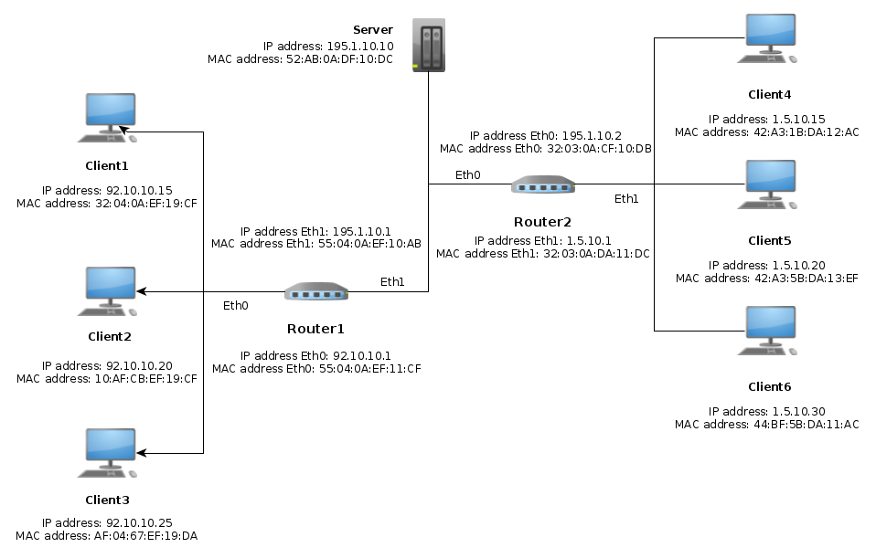

:experimental:
:sourcedir: src

ifdef::env-github[]
:tip-caption: :bulb:
:note-caption: :information_source:
endif::[]

= Simple Network Simulator

This project was developed for the Network Programming course.
The aim is simulating a Client-Router-Server architecture like the one in
the following image:

== Features

=== Basic features

- A server must keep track of which clients enter and leave the network.

- When a client (active on the network) wants to send a message to another client, he will have to send the message to the server which will deliver the message to the recipient only if the recipient client is active, alternatively it will return a message to the sender indicating that the recipient client is not online.

- The IP and Ethernet headers must be considered in the simplified version, that is, composed only of the IP and Mac Address addresses.

=== Complementary features

- Specifications of the entities that made up the network are stored in a configuration file named `network.yml`. A different number of clients, routers and servers could be created to simulate the network.

- The arp tables are dinamically created by the routers.

== Overview

The interaction with the application happens through a simple TUI.
To each command is associated a numerical id. A description of the available
commands can be accessed pressing kbd:[4] in the commands' list.

The result of each executed command is registered in a log called
`messages.log`. To understand what happens during the simulation that file
should been seen.

The network's architecture is implemented using multiple threads.

When a client goes online a corresponding thread, listening for incoming
messages, will be launched. The same happens for the server, the
first entity of the network that goes online.

There are two types of routers:

- a *main router*, the only one directly connected to the server;
- an *auxiliary router* that is connected to another router.

When the main router is launched a daemon thread for establishing connections
with the server is created.  As soon as the connections is established the
thread closes. Any other interaction with this router requires a new daemon
thread to be spawned.

This happens when:

- a client goes online or offline;
- a message is sent to one of the clients of the network

When one of these actions is completed the thread closes.

An *auxiliary router* works differently.

gi da parte del router principale. In ogni caso i client per comunicare con il
 router creano un apposito thread.

=== Starting the simulation

First check if <<Requirements>> are met.
To start the simulation, just issue the command:

`python3 ./cli.py`

TIP: On Windows an environment (shell + editor) like https://docs.python.org/3/library/idle.html[IDLE] can be used to launch the simulation.

=== Stopping the simulation

To stop the simulation just press kbd:[Ctrl + C] or use the command `Quit` on the commands' list.

In both cases a cleaning procedure, that asks all threads to stop in brief time, will be launched. All opened connections will be closed.

== Requirements

This program was developed with the `Python interpreter 3.8.2 64-bit`.

The only additional library required is https://github.com/yaml/pyyaml[PyYAML] to parse the configuration
file.

It can be installed with the `pip` package manager, with this command:

`pip install pyyaml`
